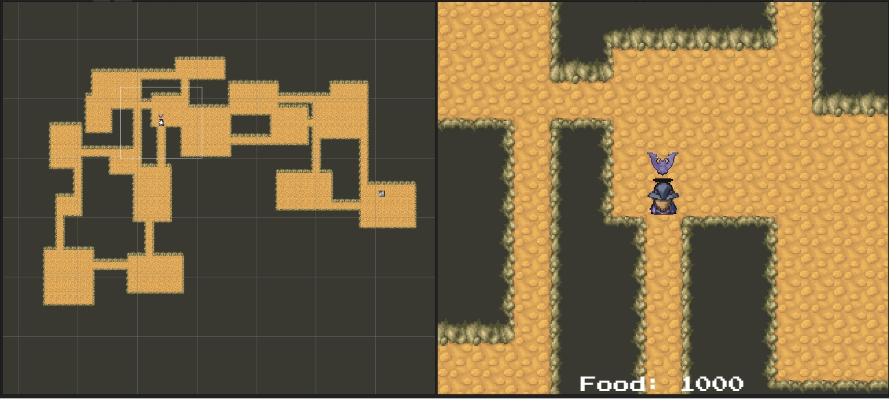
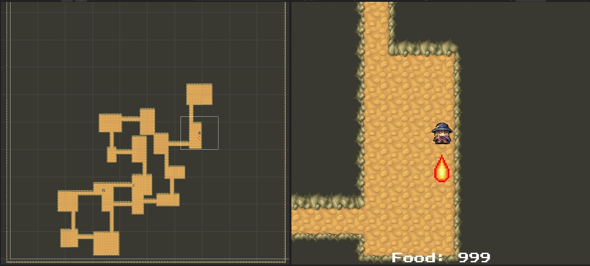

# MysteryDungeon
An experiment at making a Mystery Dungeon Clone

## Features
* Randomly Generated Levels using carving method
* Grid based A* Pathfinding Enemies 
* Unity tilemapping for neighbour aware wall sprites

## Sample Screenshots

